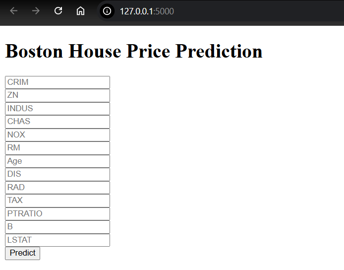

<!-- The steps to how to make it a professional project from perfect explanation in readme to the final implementaion is there -->

### boston house pricing prediction

### Software and Tools Requirements

1. [GitHub Account](https://github.com)
2. [Heroku Account](https://heroku.com)
3. [VS Code IDE](https://code.visualstudio.com)
4. [Git CLI](https://git-scm.com/install/)

Create a new environment
```
conda create --name venv1 python==3.10 -y

```




